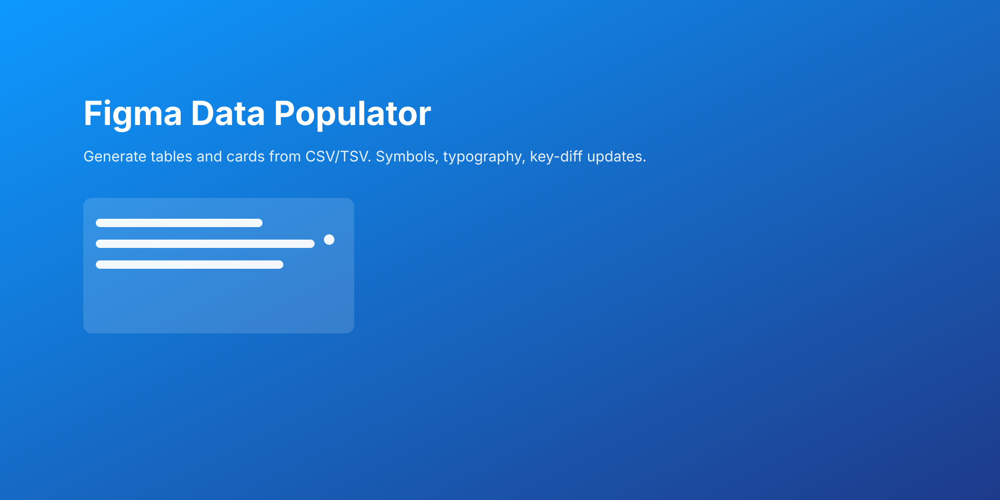

Figma Data Populator

- Populate Figma tables and cards from CSV/TSV
- Capture selection to generate a CSV schema for LLM prompts
- Apply data to selected cards (row 1 → card 1, etc.)

**Install (Local Development)**
- In Figma Desktop: `Menu` → `Plugins` → `Development` → `Import plugin from manifest...`
- Select `manifest.json` from this repo.

**Features**
- Tables
  - Paste or import CSV/TSV and generate a responsive table with header, zebra striping, and optional scrollable body.
  - Column Setup lets you define Text vs Symbol columns, widths (px/fill), align, and variant mappings.
  - Capture table specs from an existing table to pre-fill headers and column setup.
- Cards
  - Select cards with consistent layer names and apply CSV rows to each selected card.
  - Supports text layers, variant instances (via `Symbol prop`), image fills from URLs, and value mappings.
  - Configure Card: define layer list, size, and symbol mappings.
  - Card CSV tools: build a schema CSV from configured layers or capture CSV from the last Cards selection.

**Quick Start**
- Tables
  - Paste CSV into the text area and leave “First row is header” checked if applicable.
  - Optionally adjust column setup and typography under `Configure Columns`.
  - Click `Generate` to create the table near the viewport center.
  - To update an existing generated table, select it and click `Update In Place (Selection)`.
- Cards
  - Select one or more cards (Frames/Components/Instances) with similar layer names.
  - Click the camera button to `Capture` the selection (mode: Cards).
  - Paste or import CSV, then `Generate` (creates a new set) or `Update In Place` (modifies selected).
  - In `Configure Card`, use `Card CSV` to build/capture CSV for LLM prompts.

**Images & Network Access**
- To fill an image layer from a CSV URL, set `Image field` to the CSV column name and `Image layer` to the target layer name.
- Allowed domains are controlled by `manifest.json` → `networkAccess.allowedDomains`.

**Packaging**
- On every push, GitHub Actions zips the plugin (manifest, UI, main, assets) and uploads it as an artifact.
- On creating a release, the ZIP is attached to the GitHub release as an asset.

**How To Use The ZIP**
- Download the artifact/release ZIP and extract.
- In Figma Desktop, import via `Plugins` → `Development` → `Import plugin from manifest...` and pick the extracted `manifest.json`.

**Development**
- Key files
  - `manifest.json` — Figma plugin manifest
  - `main.js` — plugin (code) side
  - `ui.html` — UI (iframe) code
  - `assets/` — icons and cover image
- Docs
  - `docs/USAGE.md` — additional usage notes
  - `docs/PUBLISHING.md` — tips for publishing to the Figma Community

**Contributing**
- PRs welcome. Please avoid committing API keys or private data. `.env` is already git‑ignored.

